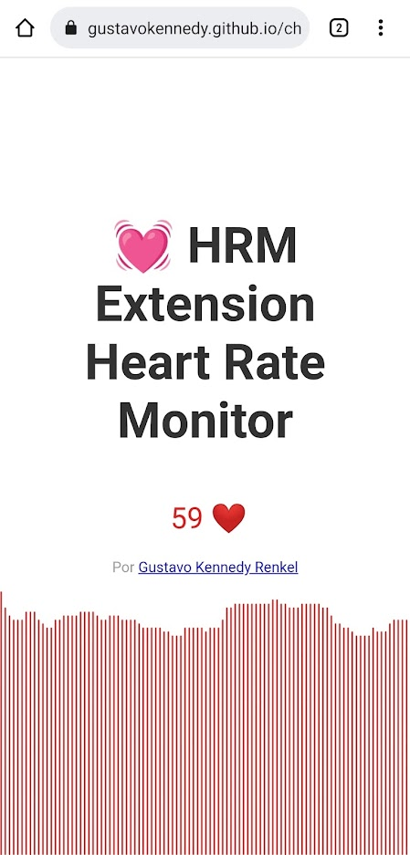

<h1> HRM Extension - Heart Rate Monitor</h1>

Repositório para criar uma <b>extensão Chrome</b> informando em tempo real a taxa de frequência cardiaca conectada via Bluetooth.

A ideia surgiu da falta de monitoramento cardíaco enquanto é usado o computador. Como eu treino e faço acompanhamento de zonas de frequência, os batimentos cardíacos em repouso também são importantes para o relatório da saúde.

### Funcionamento da extensão
A ideia da extensão é enviar em ***tempo real,*** conectado via bluetooth os dados da frequência cardíaca; facilitando o acompanhamento pelo navegador Chrome.

### Sensor de frequência cardíaca
 * <a href="https://developer.mozilla.org/pt-BR/docs/Web/JavaScript/About_JavaScript">Javascript</a>
 * <a href="https://github.com/WebBluetoothCG">WebBluetoothCG

### Extensão
  * <a href="https://developer.chrome.com/docs/extensions/mv3/intro/">Chrome Extension - Manifest V3</a>

### Demonstração Web/Mobile
Na demonstração pelo navegador, é possível conectar o equipamento via ***bluetooth*** e os batimentos cardíacos são atualizados em tempo real na página/tela. Para acessar a <a href="https://gustavokennedy.github.io/chrome-extension-heart-rate-monitor/"> demonstração pelo navegador clique aqui.</a>

### Demonstração Extensão
Na pasta ***chrome-extension*** estão os arquivos da extensão. Atualmente ela possui a tela de Popup, onde será mostrado o batimento cardíaco ao clicar no ícone da extensão; e a página de ***Opções***, onde será feito o pareamento do dispotivo bluetooth.

### Issues
 * <a href="https://github.com/gustavokennedy/chrome-extension-heart-rate-monitor/issues/1">BPM no ícone da extensão #1</a>
